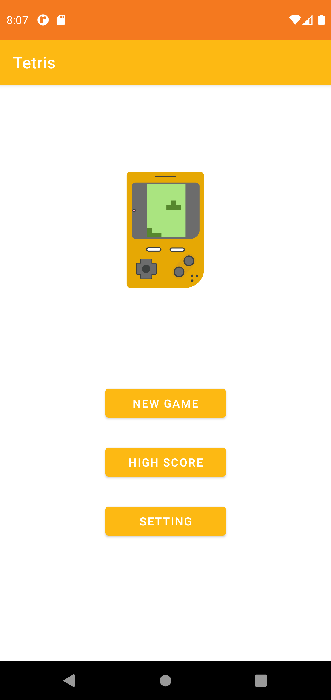
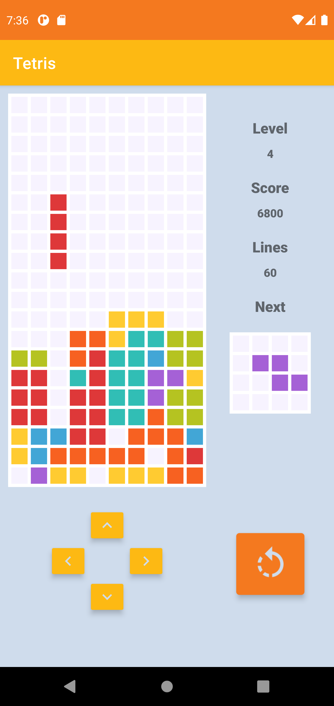
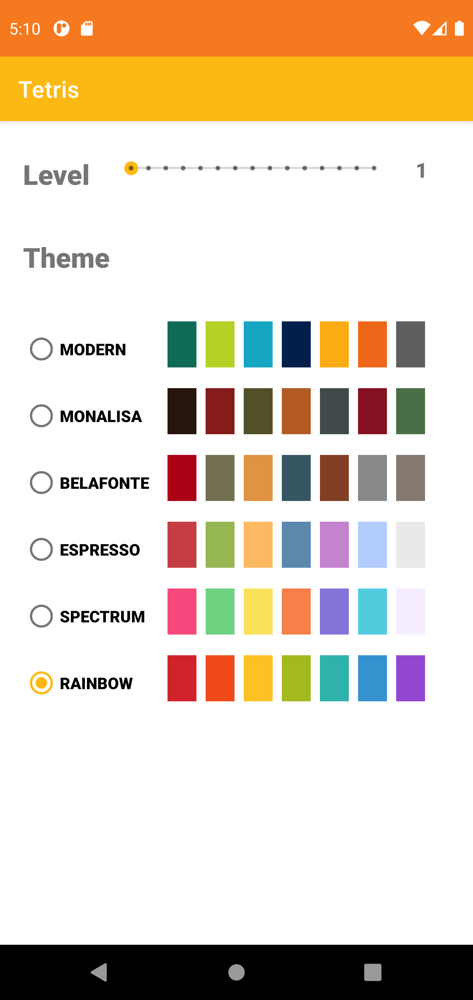

# Tetris

This is a clone of the evergreen video game Tetris on Android platform developed using Java and Kotlin. 

## 🧐Features 

## 📝Library Usage
* Room 
* DataStore
* Coroutine
* Lottie
* Konfetti

## 🎈Screenshots

&#160;
&#160;
