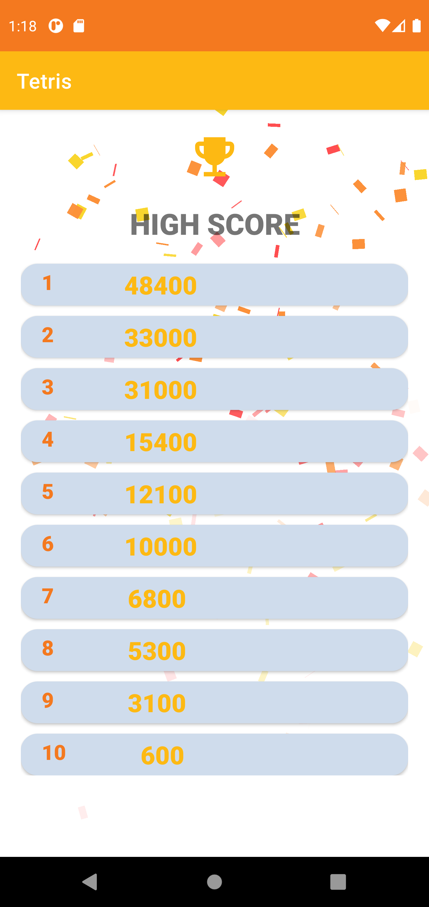

# Tetris

This is a clone of the evergreen video game Tetris on Android platform developed using Java and Kotlin. 

## 🎮Instruction

|button|control|
|:---|:---|
|⬆️|fast drop to the bottom|
|⬅️|move block to the left|
|➡️|move block to the right|
|⬇️|move block fast|
|Rotate|rotate block counterclockwise|

**Score** 

|Line|Score|
|:---|:---|
|Single|100|
|Double|200|
|Triple|400|
|Tetris|800|

**Level**         
Level up by clearing 20 lines.          
Initial level could be changed in the setting screen.       

**Speed**          
A block would move down 1 unit per second in level 1. Droping speed would increasing by 0.05s for every level up.        

## 🧐Features 

## 📝Library Usage
* Room 
* DataStore
* Coroutine
* Lottie
* Konfetti

## 🎈Screenshots

&#160;
&#160;
